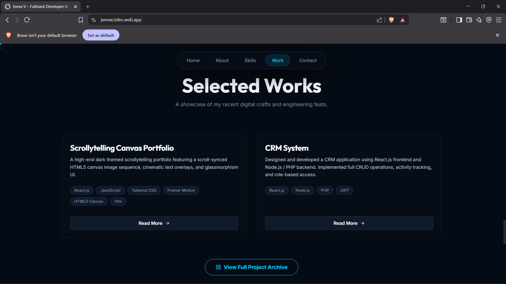
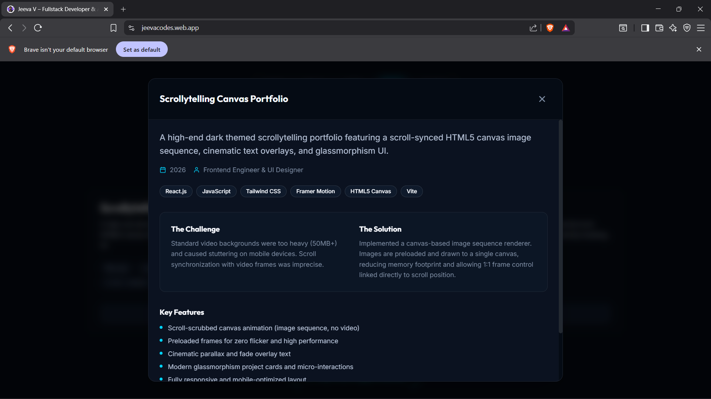
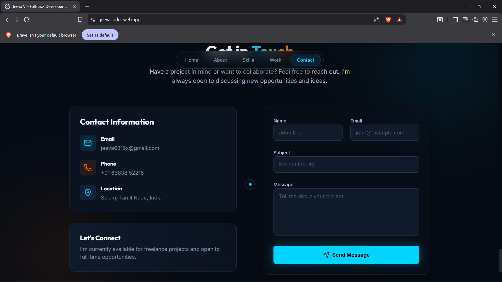

# ✦ Jeeva's Portfolio v2

[](https://opensource.org/licenses/MIT)
[](https://jeevacodes.web.app)
[](https://react.dev)
[](https://firebase.google.com)

> An immersive, Awwwards-style developer portfolio featuring scrollytelling animations, WebGL-like canvas effects, and premium glassmorphism UI.

**[🌐 Live Demo](https://jeevacodes.web.app)**

---

## 🎨 Visual Showcase

### 1. Cinematic Hero Section
A scroll-driven image sequence animation (`ScrollyCanvas`) that creates a video-like experience optimized for performance.


### 2. Interactive Projects Grid
A curated selection of work with glassmorphic cards, hover micro-interactions, and detailed project modals.



### 3. Contact & Loader
Smooth entry animations and a fully functional contact form integrated with EmailJS.



---

## ✨ Features

- **🎥 Scrollytelling Canvas**: High-performance image sequence rendering synchronized with scroll position.
- **🔮 Glassmorphism UI**: Modern aesthetic with backdrop blurs, gradients, and subtle borders.
- **⚡ Performance Optimized**: 
  - Image preloading for zero-flicker animation.
  - `Lenis` smooth scrolling for a premium feel.
  - Mobile-first responsive design.
- **🧩 Component Architecture**:
  - Reusable `Modal` and `Overlay` components.
  - Separation of concerns between Logic and UI.
- **📮 Functional Integration**:
  - Contact form with Zod validation.
  - Real-time email delivery via EmailJS.

---

## 🛠️ Tech Stack

| Domain | Technologies |
| :--- | :--- |
| **Core** |   |
| **Styling** |  |
| **Animation** | `Framer Motion` `Lenis` `GSAP Concepts` |
| **Forms** | `React Hook Form` `Zod` `EmailJS` |
| **Deployment** |  |

---

## 🚀 Getting Started

### Prerequisites
- Node.js (v18+)
- npm or yarn

### Development Tools
- **VS Code**: Recommended extensions are included in `.vscode/extensions.json`.
- **Firebase Config**: Copy `firebase.json.example` to `firebase.json` if deploying.

### Installation
1.  **Clone the repository**
    ```bash
    git clone https://github.com/JeevaVenkidu/awwwards-style-portfolio-2026.git
    cd awwwards-style-portfolio-2026
    ```

2.  **Install dependencies**
    ```bash
    npm install
    ```

3.  **Environment Setup**
    Create a `.env` file in the root directory:
    ```env
    VITE_EMAILJS_SERVICE_ID=your_id
    VITE_EMAILJS_TEMPLATE_ID=your_id
    VITE_EMAILJS_PUBLIC_KEY=your_key
    ```

4.  **Run Locally**
    ```bash
    npm run dev
    ```

### Available Scripts

| Command | Description |
| :--- | :--- |
| `npm run dev` | Starts the development server. |
| `npm run build` | Builds the app for production. |
| `npm run lint` | Runs ESLint to check for code quality issues. |
| `npm run preview` | Previews the production build locally. |

---

## 📦 Deployment

This project is configured for **Firebase Hosting**.

```bash
# 1. Build the project
npm run build

# 2. Deploy to production
firebase deploy --only hosting
```

---

## 🤝 Contributing

Contributions are welcome! Please check the [Contributing Guidelines](CONTRIBUTING.md) and [Code of Conduct](CODE_OF_CONDUCT.md).

1. Fork the Project
2. Create your Feature Branch (`git checkout -b feature/AmazingFeature`)
3. Commit your Changes (`git commit -m 'Add some AmazingFeature'`)
4. Push to the Branch (`git push origin feature/AmazingFeature`)
5. Open a Pull Request

---

## 📄 License

Distributed under the MIT License. See [LICENSE](LICENSE) for more information.

---

## 🏆 Acknowledgements

- **Design Inspiration**: Awwwards, Dribbble trends.
- **Icons**: [Lucide React](https://lucide.dev) & [React Icons](https://react-icons.github.io/react-icons/).
- **Fonts**: [Outfit](https://fonts.google.com/specimen/Outfit) (Google Fonts).

---

<div align="center">
  <sub>Built with ❤️ by <a href="https://github.com/JeevaVenkidu">Jeeva V</a></sub>
</div>
